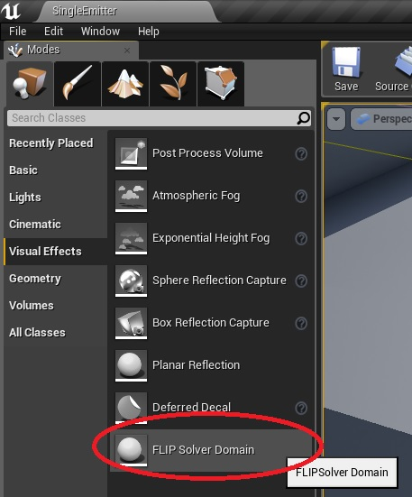
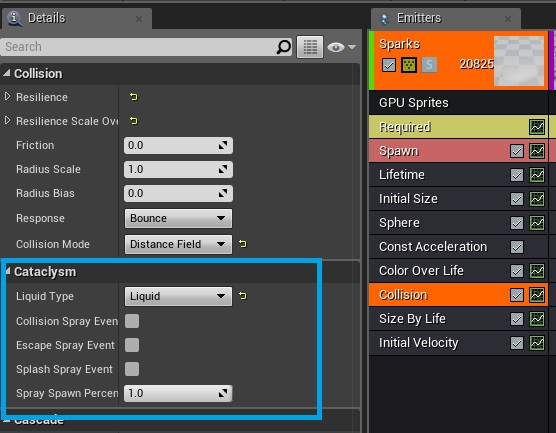
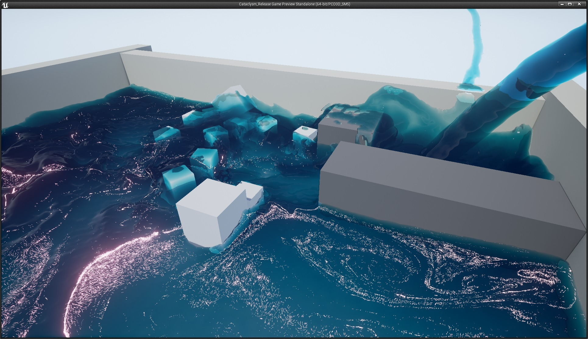
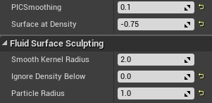
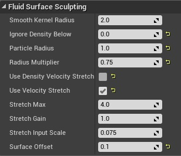

Cataclysm
===

The Cataclysm Liquid Solver can simulate up to two million liquid particles within the UE4 engine in real time.  It uses a custom FLIP based GPU solver at its core.  The custom solver is combined with Unreal Engine 4's GPU Particles with Distance Field Collisions to allow artists to flood environments with liquid.

Getting Started
---

Hello,

Thanks for your interest in Cataclysm.  Cataclysm is an R&D Experiment, and not a supported product, but we learned a lot building
it (it was my first time using UE4 and writing DX shaders), and we wanted to get the code out there to let everyone else have fun with it.

Cataclysm was developed in DX 11.3, and is Windows 10 only due to its use of [Volume Tiled Resources](http://wccftech.com/nvidia-shows-advanced-directx-12-features-ray-tracing-volume-tiled-resources/).  If you try to run the demo with an OS that does not support dx11.3 the liquid will not show up in the scene.

The maps in the above video are in `ArtContent[1-4].zip`, and the controls for the levels are as follows:

|       Map      |    control      |   particle debug    | individual drains | collectve drain | aim camera     | freecam toggle | stats      | camera spew   | SloMo | Play demo|
|----------------|-----------------|---------------------|-------------------|-----------------|----------------|----------------|------------|---------------|-------|----------|
| Museum         | xBox controller | d-pad left or right |    X,Y,B,A        | right bumper    | right joystick | d-pad down     | d-pad up   | right trigger | n/a   | n/a      |
| Museum         | keyboard        | 1 or 2              | n/a               | Down arrow      | n/a            | F              | `stat fps` | n/a           | n/a   | n/a      |
| nvSquare       | keyboard        | 1 or 2              | n/a               | n/a             | n/a            | n/a            | `stat fps` | n/a           | T     | space bar|
| Cataclysm Demo | keyboard        | 1 or 2              | n/a               | n/a             | n/a            | n/a            | `stat fps` | n/a           | T     | space bar|

Note if nvSquare or Cataclysm Demo are paused at start, just hit the `space bar` to play the sequence.

There is also a single developer map, `\Maps\Dev\SingleEmitter.umap`, which
can be found in `DevContent.zip`.  The SingleEmitter map has all the UE4 actors set up and ready to go, with some decent settings for a liquid emitter, and solid boundaries that hold liquid.  Alternatively, you can follow the steps below to build your own level.

1. If you don’t already have the Unreal Engine 4 (Cataclysm uses version 4.15),  follow the instructions for [Unreal Engine](#unreal-engine) to build the custom Cataclysm Demo engine from this branch.
2. Open a starter level, and make sure UE4 distance fields are turned on.
3. Create a GPU particle emitter, and on the collision module make sure Collision Mode == Distance Field, and Cataclysm: Liquid Type == Liquid
4. Add a FLIP Domain Solver (search, or placement tool, under Visual Effects).

Please write [Mark Carlson](mailto:mcarlson@nvidia.com), <mcarlson@nvidia.com>, if you have further questions.

Enjoy,

Mark

UE4 Components
---
Cataclysm is a custom FLIP solver, integrated into UE4. There are a few components that tie the solver into the Unreal Editor and Engine.  Most of the code for cataclysm is in the `\Engine\Source\Runtime\Engine\Private\Fluid\` folder, or in shaders prefixed with the word `Fluid`.  Searching the code for `CATACLYSM` will turn up the other places where the solver ties into UE4.  The main components are described below.

### FLIP Solver Domain Actor
To use Cataclysm's FLIP solver, you must add a FLIP Solver Domain actor to your scene.

The solver domain is the grid in which the simulation will take place.  You can move it by translation only, and you can scale the size of it by changing the `Voxel Width` parameter.  The domain size itself is measured in number of voxels, the default size is 512 x 512 x 256, and that fixed size can only be changed at compile time.  The bounding box size of the domain in world space is `Voxel Width` x `Grid Size`.

You can visualize the FLIP Solver Domain bounding box by setting the `Fluid.ShowBricks` console variable to non zero.  This will show you two things: the outline of the solver domain bounding box in red, and, the sparse set of Bricks that the simulation uses.  *Bricks* are the term used for the active areas within the domain grid on which the simulation is run.  The full domain is never used in Cataclysm because Cataclysm is a sparse grid simulation that 
uses [Volume Tiled Resources](http://wccftech.com/nvidia-shows-advanced-directx-12-features-ray-tracing-volume-tiled-resources/).  Typically, our examples are designed to use a sparse set of about 200 Thousand voxels or less, but the solver will scale to over 4 Million voxels and even higher if you want to set it at compile time.  The entire 512 x 512 x 256 domain is not used in full, only the sparse set of bricks that are needed to hold the shape of the liquid volume created from the particles.

### GPU Particles With Distance Field Collision

Once you have a FLIPSolverDomain in the scene, you have to add particles that the solver will then identify and simulate at run time.  Cataclysm uses Unreal Engine 4's [GPU Particles](https://wiki.unrealengine.com/Introduction_to_Particles_in_UE4_-_5_-_Creating_a_GPU_Sprite_Emitter) by adding a custom parameters to the collision module of the particle emitter.

By setting the `Collision Mode` to `Distance Field` and the `Liquid Type` to `Liquid` you are telling the solver domain that these GPU Particles will be used as Liquid particles in the Cataclysm Solver.

You must make sure that UE4's [Distance Fields](https://docs.unrealengine.com/latest/INT/Engine/Rendering/LightingAndShadows/DistanceFieldAmbientOcclusion/) are enabled in the project, and when you create assets for collision, you should use closed meshes, and make sure the [scaling is uniform](https://answers.unrealengine.com/questions/391773/gpu-particles-mesh-distance-fields.html).

Solver Overview
---

Figure: A Cataclysm simulation with sprite foam and 2 Million Liquid particles.

A FLIP solver is a hybrid grid and particle technique for simulating fluids.  All Information for the fluid simulation is carried on particles, but the solution the the physical simulation of the liquid is carried out on a grid.  Once the grid solve is complete, the particles gather back up the information they need from the grid move forward in time to the next frame.

The rest of this document will describe details specific to Cataclysm, but if you are interest in fluid solvers in general a quick web search will turn up a lot of information about FLIP solvers, and [Robert Bridson's book](https://www.crcpress.com/Fluid-Simulation-for-Computer-Graphics-Second-Edition/Bridson/p/book/9781482232837) is also a good source of information.

### Liquid Boundary

At the beginning of the frame, there is no grid to simulate the fluids on.  There is only the particles with their position and velocity.  The first thing the solver does is Identify the the liquid boundary that is inside the bounding box of the [FLIP Solver Domain](#flip-solver-domain-actor).  The liquid boundary is different from the [liquid surface](#liquid-surface) we render, and the distinction between the surface and the boundary is important because the liquid boundary is only seen by the solver, and anything within that boundary is solved on the grid.  There are two ways to create the surface, both are controlled by the `Surface at Density` parameter on the [FLIPSolverDomain](#flip-solver-domain-actor).

The particle positions and the `Smooth Kernel Radius` parameter are used to splat the particles into a 3D smooth density texture (`SmoothDensityVTR` in the code).   If the `Surface at Density` parameter is positive, then the liquid domain will be the level set of the smooth density field at that value.  If the `Surface at Density` is 0 or a negative value, than the liquid domain will use spheres at the particle locations and the `Particle Radius` parameter to create the outline of the liquid domain.  In that case it will also ignore any particles that have a smooth density value greater than the absolute value of `Surface as Density`.  The most detailed liquid domains will come from a 0 `Surface at Density` value, but that can make single particle cause noise and float on the surface, so generally a small negative value is best for a detailed liquid boundary, or a positive value can be used for a liquid boundary that is faster to create but less detailed.

### Solid Boundary
The Solid boundary is created for the solver from the same distance fields UE4 uses for GPU particle collision, which is the reason Liquid particles have to have the Distance Field collision type on their collision module.  We want the solid boundary that the simulation sees to be the same one that the particles see.  The solid boundary is used to set up the other set of boundary conditions for the fluid solver.  The `Voxel Width` controls the voxel size of the grid, but the solid boundaries have a bit more detail because Cataclysm uses the [variational boundary technique](https://www.cs.ubc.ca/labs/imager/tr/2007/Batty_VariationalFluids/).

If you want to have your levels hold water, then you will need to have closed meshes for your level geometry, and they should be thicker than the `Voxel Width`.  Meshes can be smaller, but the fluid simulation will leak through them or go around them, only noticing them as partially solid voxels.

### Grid Solve
Once the liquid and solid boundary are identified, the velocity from the particles is transferred to the grid with a [sharp kernel](http://research.nii.ac.jp/~rand/sheetflip/tvcg.html).  The divergence of the grid velocity is computed, and anywhere that divergence is not zero in a voxel we know that there is either too much liquid entering the voxel, or too much leaving it.  A technique known as pressure projection is used, where we utilize a change in pressure to find the velocity that will make all the voxels have as close to a zero divergence as possible.  The important thing for the FLIP technique is not how we get to a final velocity with a zero divergence, but that we keep the velocity from before and after the solve.

### FLIP Advection
Once the grid solve is completed, the particles are moved through the grid with the final solved velocity.  However, the velocity that the particles move with and the velocity that they must splat onto the grid for the next frame are not the same.  Each particle also has a splat velocity  stored on it.  The `PICSmoothing` parameter is what controls the value of the splat velocity.  If you want a very damped simulation, you can increase the `PICSmoothing` to 1, and the final velocity interpolated from the grid will be the same as the splat velocity.  Because linear interpolation is used to get the velocity from the grid, and because the voxels are rather large, a `PICSmoothing` of 1 is not recommended.  If the `PICSmoothing` is 0, then particles will keep their existing splat velocity, and instead of replacing it with the interpolated grid velocity, we just subtract the difference of the interpolated grid velocity before and after the grid solve.  So, even though the particle is moved forward in time with the pure interpolated grid velocity, the information it carries in the splat velocity about the change in grid velocity gives the particles higher resolution detail, and makes the simulation  much more lively and dynamic looking.  A little PIC smoothing will help the particles though, so the value defaults to a small non zero value.

Rendering and Visuals
---

There are several things that control the look of the simulation without actually affecting how the particles are simulated and move through the grid.  The liquid surface is the main rendering object, but you can visualize the sprite particles as you would with a normal GPU particle simulation by setting the `Fluid.ShowLiquidSprites` console parameter to non zero.  By default, sprites are not shown if they are inside the liquid, so if you want to see all the particles, you also have to turn `Write Surface Depth` off in the `Fluid Rendering Material`.  Beyond the shape of the surface, wave and foam detail can be added, as well as foam sprite particles.

### Liquid Surface
As mentioned earlier, the liquid surface is what we actually render, and is different from the  [liquid boundary](#liquid-boundary).  At compile time, the resolution of the liquid surface can be the same as the liquid boundary, or it can be twice the resolution.  The `LS_MULTIPLIER` (Level Set Multiplier) defaults to 2, which makes the surface twice the resolution as the boundary in each dimension (8 x the detail), but reducing it to 1 will allow for faster surface creation, faster rendering and lower memory footprint.  The trade off is more grid crawling artifacts, where the grid locations can be seen as sharp spikes in the outline of the particles.  The spikes stay in the same location in space as the grid, and the particles can be seen moving through the the grid in a strange way.

The shape of the surface is controlled through the Fluid Surface Sculpting parameters on the [FLIPSolverDomain](#flip-solver-domain-actor).  The Liquid Surface starts out the same as the initial Liquid Boundary, but shrunk by the `Surface Offset` parameter.  So if you have a simulation that moved well, but the surface is too fat and smooth at render time, you can have a large `Surface Offset`, and the liquid you see will start out thinner.  Negative values will grow the initial surface.  Starting from the offset liquid boundary, you can choose to add spheres onto the surface for detail.  If you are happy with the offset surface, then you can set the `Radius Multiplier` to 0, and no spheres will be add to the surface.  If the radius multiplier is non zero, then any particle with a smooth density below the `Ignore Density Below` parameter will be splatted onto the surface with a radius of `Particle Radius` x `Radius Multiplier`.  There is also an option to stretch the spheres into anisotropic ellipsoids based on their velocity, by checking the `Use Velocity Stretch` check box.  Note that the `Use Density Velocity Stretch` will actually use the same anisotropy on the initial smooth density splat, and may make for a more detailed simulation in some situations because that smooth density is used in both the liquid boundary and the liquid surface.

### Sprite Foam
Sprite foam allows artists to place emitters that will spawn particles which stick to the surface of the liquid and move with it.  Any GPU particle will work, but the `Liquid Type` on the particle collision module has to be set to `Foam`, and they should in general be near the surface of the liquid or they will not be able to move to it in order to stick and move on it.

### Wave Noise
Wave noise is computed and added with texture coordinates.  If `Enable Waves` is checked in the Fluid Rendering section of the [FLIPSolverDomain](#flip-solver-domain-actor), then two sets of texture coordinates will be moved, regenerated and blended with the surface.  When waves are enabled, you can view these textures by setting the `Fluid.ShowTexCoords` console variable to non zero.  The wave noise rendering can be expensive, but there are markers for in when you use profilegpu, so you can keep an eye on it.

### Diffuse Particles
When `Enable Diffuse Particles` is true, [another simulation](http://cg.informatik.uni-freiburg.de/publications/2013_WSCG_foamRendering.pdf) is run  which adds foam spray and bubbles.  The number of Diffuse particles is the same as the number of liquid particles, and running it can add a lot of time to the solver, but you can keep an eye on it with profilegpu.

Further Reading
---
For more information on how Cataclysm works, and how to use it, try the documentation below.

* A collection of [Questions and Answers](doc/QandA.md) from forums emails.

---

Unreal Engine
=============

Welcome to the Unreal Engine source code! 

From this repository you can build the Unreal Editor for Windows and Mac, compile Unreal Engine games for Android, iOS, Playstation 4, Xbox One, HTML5 and Linux,
and build tools like Unreal Lightmass and Unreal Frontend. Modify them in any way you can imagine, and share your changes with others! 

We have a heap of documentation available for the engine on the web. If you're looking for the answer to something, you may want to start here: 

* [Unreal Engine Programming Guide](https://docs.unrealengine.com/latest/INT/Programming/index.html)
* [Unreal Engine API Reference](https://docs.unrealengine.com/latest/INT/API/index.html)
* [Engine source and GitHub on the Unreal Engine forums](https://forums.unrealengine.com/forumdisplay.php?1-Development-Discussion)

If you need more, just ask! A lot of Epic developers hang out on the [forums](https://forums.unrealengine.com/) or [AnswerHub](https://answers.unrealengine.com/), 
and we're proud to be part of a well-meaning, friendly and welcoming community of thousands. 

Branches
--------

We publish source for the engine in three rolling branches:

The **[release branch](https://github.com/EpicGames/UnrealEngine/tree/release)** is extensively tested by our QA team and makes a great starting point for learning the engine or
making your own games. We work hard to make releases stable and reliable, and aim to publish new releases every few months.

The **[promoted branch](https://github.com/EpicGames/UnrealEngine/tree/promoted)** is updated with builds for our artists and designers to use. We try to update it daily 
(though we often catch things that prevent us from doing so) and it's a good balance between getting the latest cool stuff and knowing most things work.

The **[master branch](https://github.com/EpicGames/UnrealEngine/tree/master)** tracks [live changes](https://github.com/EpicGames/UnrealEngine/commits/master) by our engine team. 
This is the cutting edge and may be buggy - it may not even compile. Battle-hardened developers eager to work lock-step with us on the latest and greatest should head here.

Other short-lived branches may pop-up from time to time as we stabilize new releases or hotfixes.

Getting up and running
----------------------

The steps below will take you through cloning your own private fork, then compiling and running the editor yourself:

### Windows

1. Install **[GitHub for Windows](https://windows.github.com/)** then **[fork and clone our repository](https://guides.github.com/activities/forking/)**. 
   To use Git from the command line, see the [Setting up Git](https://help.github.com/articles/set-up-git/) and [Fork a Repo](https://help.github.com/articles/fork-a-repo/) articles.

   If you'd prefer not to use Git, you can get the source with the 'Download ZIP' button on the right. The built-in Windows zip utility will mark the contents of zip files 
   downloaded from the Internet as unsafe to execute, so right-click the zip file and select 'Properties...' and 'Unblock' before decompressing it. Third-party zip utilities don't normally do this.

1. Install **Visual Studio 2015**. 
   All desktop editions of Visual Studio 2015 can build UE4, including [Visual Studio Community 2015](http://www.visualstudio.com/products/visual-studio-community-vs), which is free for small teams and individual developers.
   Be sure to include C++ support as part of the install, which is disabled by default.
  
1. Open your source folder in Explorer and run **Setup.bat**. 
   This will download binary content for the engine, as well as installing prerequisites and setting up Unreal file associations. 
   On Windows 8, a warning from SmartScreen may appear.  Click "More info", then "Run anyway" to continue.
   
   A clean download of the engine binaries is currently 3-4gb, which may take some time to complete.
   Subsequent checkouts only require incremental downloads and will be much quicker.
 
1. Run **GenerateProjectFiles.bat** to create project files for the engine. It should take less than a minute to complete.  

1. Load the project into Visual Studio by double-clicking on the **UE4.sln** file. Set your solution configuration to **Development Editor** and your solution
   platform to **Win64**, then right click on the **UE4** target and select **Build**. It may take anywhere between 10 and 40 minutes to finish compiling, depending on your system specs.

1. After compiling finishes, you can load the editor from Visual Studio by setting your startup project to **UE4** and pressing **F5** to debug.

### Mac
   
1. Install **[GitHub for Mac](https://mac.github.com/)** then **[fork and clone our repository](https://guides.github.com/activities/forking/)**. 
   To use Git from the Terminal, see the [Setting up Git](https://help.github.com/articles/set-up-git/) and [Fork a Repo](https://help.github.com/articles/fork-a-repo/) articles.
   If you'd rather not use Git, use the 'Download ZIP' button on the right to get the source directly.

1. Install the latest version of [Xcode](https://itunes.apple.com/us/app/xcode/id497799835).

1. Open your source folder in Finder and double-click on **Setup.command** to download binary content for the engine. You can close the Terminal window afterwards.

   If you downloaded the source as a .zip file, you may see a warning about it being from an unidentified developer (because .zip files on GitHub aren't digitally signed).
   To work around it, right-click on Setup.command, select Open, then click the Open button.

1. In the same folder, double-click **GenerateProjectFiles.command**.  It should take less than a minute to complete.  

1. Load the project into Xcode by double-clicking on the **UE4.xcworkspace** file. Select the **ShaderCompileWorker** for **My Mac** target in the title bar,
   then select the 'Product > Build' menu item. When Xcode finishes building, do the same for the **UE4** for **My Mac** target. Compiling may take anywhere between 15 and 40 minutes, depending on your system specs.
   
1. After compiling finishes, select the 'Product > Run' menu item to load the editor.

### Linux

1. [Set up Git](https://help.github.com/articles/set-up-git/) and [fork our repository](https://help.github.com/articles/fork-a-repo/).
   If you'd prefer not to use Git, use the 'Download ZIP' button on the right to get the source as a zip file.

1. Open your source folder and run **Setup.sh** to download binary content for the engine.

1. Both cross-compiling and native builds are supported. 

   **Cross-compiling** is handy when you are a Windows (Mac support planned too) developer who wants to package your game for Linux with minimal hassle, and it requires a [cross-compiler toolchain](http://cdn.unrealengine.com/qfe/v8_clang-3.9.0-centos7.zip) to be installed (see the [Linux cross-compiling page on the wiki](https://docs.unrealengine.com/latest/INT/Platforms/Linux/GettingStarted/)).

   **Native compilation** is discussed in [a separate README](Engine/Build/BatchFiles/Linux/README.md) and [community wiki page](https://wiki.unrealengine.com/Building_On_Linux). 

### Additional target platforms

**Android** support will be downloaded by the setup script if you have the Android NDK installed. See the [Android getting started guide](https://docs.unrealengine.com/latest/INT/Platforms/Android/GettingStarted/).

**iOS** programming requires a Mac. Instructions are in the [iOS getting started guide](https://docs.unrealengine.com/latest/INT/Platforms/iOS/GettingStarted/index.html).

**HTML5** support will be downloaded by the setup script if you have Emscripten installed. Please see the [HTML5 getting started guide](https://docs.unrealengine.com/latest/INT/Platforms/HTML5/GettingStarted/index.html).

**Playstation 4** or **XboxOne** development require additional files that can only be provided after your registered developer status is confirmed by Sony or Microsoft. See [the announcement blog post](https://www.unrealengine.com/blog/playstation-4-and-xbox-one-now-supported) for more information.

Licensing and Contributions
---------------------------

Your access to and use of Unreal Engine on GitHub is governed by the [Unreal Engine End User License Agreement](https://www.unrealengine.com/eula). If you don't agree to those terms, as amended from time to time, you are not permitted to access or use Unreal Engine.

We welcome any contributions to Unreal Engine development through [pull requests](https://github.com/EpicGames/UnrealEngine/pulls/) on GitHub. Most of our active development is in the **master** branch, so we prefer to take pull requests there (particularly for new features). We try to make sure that all new code adheres to the [Epic coding standards](https://docs.unrealengine.com/latest/INT/Programming/Development/CodingStandard/).  All contributions are governed by the terms of the EULA.

Additional Notes
----------------

The first time you start the editor from a fresh source build, you may experience long load times. 
The engine is optimizing content for your platform to the _derived data cache_, and it should only happen once.

Your private forks of the Unreal Engine code are associated with your GitHub account permissions.
If you unsubscribe or switch GitHub user names, you'll need to re-fork and upload your changes from a local copy. 

