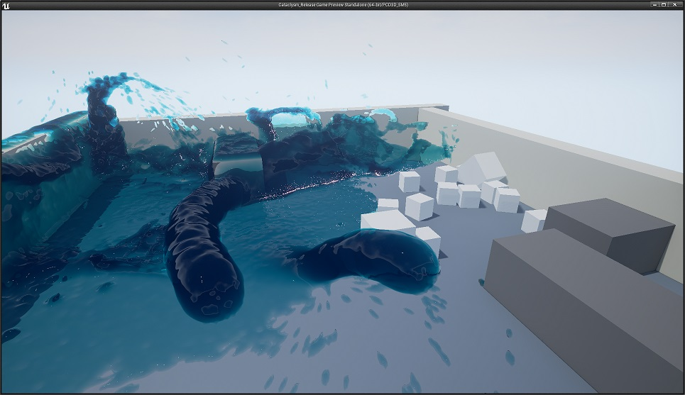
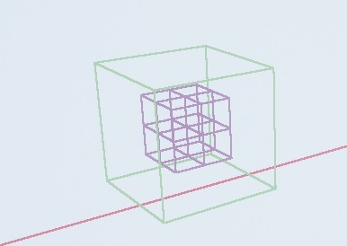
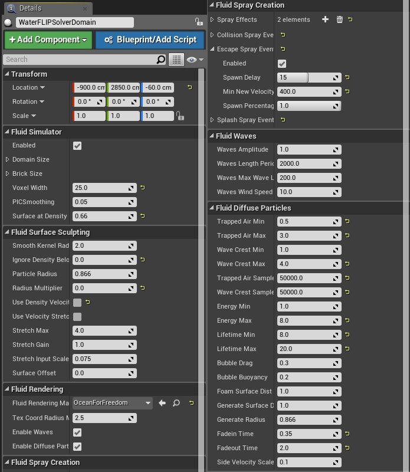

Cataclysm Questions and Answers
===
This Markdown file is simple a collection of questions and aswers from forums and emails.  If you have futher questions, please send them to [Mark Carlson](mailto:mcarlson@nvidia.com), <mcarlson@nvidia.com>.

**Is there a way of inferring the 'weight' of the particles in any given volume?**
---

There is a complex answer to that, and the question can be interpreted in a few ways, so bear with me.

1. If by weight, you mean you want some particles to float, and some to fall faster, then yes. On a per-emitter basis,
you can change the Const Acceleration module on the emitter in cascade. In fact using the cascade to change around the attributes 
is one of the great powers of Cataclysm. The image below shows two emitters. The emitter on the right has the a slight leftward 
acceleration added, it's particles are going toward the wall like gravity has changed. For the emitter on the left, I decreased 
the acceleration down by an order of magnitude, and added som edo the right, so those particles stay in the air longer and rush 
to the right. So each emitter has it's own gravity, and that is taken into account in the simulation, the same way other cascade 
particle attributes are for GPU particles. 

2. If by weight you mean, you have 10 particles in a voxel and you want 1 to affect the velocity more then the other 9, then no, 
all the particles have the same weight in that sense. However, Cataclysm sees all the per particle attributes that Cascade passes 
to the GPU particles. So if you wanted to take over one of those and use it as a weight you may be able to do that. You could 
also add your own per-particle attribute in ParticleGPUSimulation.cpp. Similar to how `class FParticleStateTextures` has 
RandomSubImageTexture, or if you just want it for the liquid you would add it to `class FLiquidParticleStateTextures` similar to 
FLIPVelocityTexture. Then, you could access it inside FluidVelocityToGrid.usf the same way VelocityTexture is used but use it as 
a weight that blends with the normal distance weighted contribution.

3. If by weight you mean how much mass a particle has then the short answer is that FLIP particles have no mass, and they are only
used as tracer particles to define the volume in the voxel grid to simulate. So you can't really make them heavier in that sense. 
However, for FLIP to work well, you really want to have more than one particle per voxel contributing. 8 particles per voxel is a common target 
in research papers, and 4 seems to work good. Anything above MAX_SPLAT_COUNT (defaults 12) will be ignored for velocity/smooth density/surface 
contribution (that trick is specific to Cataclysm, and not normal FLIP behavior). You can see how large the grid voxels are by using the console 
variable `Fluid.ShowBricks 1`. When you do that, you will see the walls of the max domain outlined in red, and you will see in the center a 
brick in green, and a set of 8 voxels in purple.

The splat radius for the velocity is fixed. So each particle is guaranteed to contribute it's velocity to a voxel. But if you lower the 
`Smooth Kernel Radius` (which defines the liquid domain if `Surface At Density is > 0) of the `Particle Radius` (which defines the liquid domain 
if `Surface At Density` <= 0), your particle will have less affect on the simulation and you will get less liquid volume. For less visual volume, 
separate from the simulation volume, you can lower the `Radius Multiplier` which only affects the rendered liquid surface.

**I'm only getting very "blobby" streams flowing forward from any particle emitter, how do I get better surfaces?**
---

The simulated liquid domain and the rendered liquid surface don't have to match.  The liquid domain is the starting basis for 
the rendered liquid surface, and controls the flow of the simulation.  There are two types of liquid domain generation:

1. If `Surface at Density` is Positive, Cataclysm extracts a levelset at the value `Surface at Density` from a smooth density 
field created from particle splatting, where each particle has a radius of `Smooth Kernel Radius` (in units of Voxel Width, so 
the default radius of 2 would splat up to 4 voxels wide, you can see the kernel used in `FluidDensityToGrid.usf`). Shrinking 
the `Smooth Kernel Radius` to 1.5 may help, but will give you less liquid volume, and I have noticed some different results 
with `Use Density Velocity Stretch` on, which will make velocity anisotropy on during the density splat... the differences are 
subtle and for me not worth the increased work. Your millage may vary. 

2. If `Surface at Density` is <= 0, Cataclysm extracts a levelset from sphere splatting with radius `Particle Radius` (also in 
voxel units). This can be a more complex surface, and for liquid domain, there may be too much surface noise for a nice solution 
so Cataclysm uses abs(`Surface at Density`) to cull out particles with a density below that. The noise problem will look like 
loose particle floating on the surface and causing cottage cheese looking floaties (technical language, I love it). 

Those two techniques are only for generating the simulated liquid domain. Which controls how the simulation moves, and is the 
start levelset for the rendered liquid surface. If you want to get rid of that simulation surface before you create the rendered 
`liquid surface` for display, you can set the `Surface Offset` to a high number which will basically delete the entire liquid 
domain and build the rendering surface from scratch, instead of union-ing it with the liquid domain first. After starting with 
the offset liquid domain, the rendered liquid surface is always built with the sphere levelset splatting technique with a radius 
of `Particle Radius` x `Radius Multiplier`. Since LS_MULTIPLIER defaults to 2, Cataclysm is actually rendering at twice the 
surface resolution from the simulation, which gives you a detailed surface even with smaller radius multiplier (too small and 
particles may pass between voxels instead of rasterize too them). But if you always start with a smooth liquid domain, and don't 
offset it, then all the extra detailed may be buried inside the start surface and never seen.

Anyway, getting a detailed surface is difficult and we never settled on the perfect solution. You could run the simulation, skip 
building the high resolution levelset for rendering, and render the particles in an entirely new way.

**I haven't been able to get any sort of foam-looking generation like in your flooded cityscape.**
---

To get diffuse particle foam, like the ones used in the city, you have to have the `Enable Diffuse Particles` 
box checked. That's an entirely different simulation for visuals only and won't affect the liquid flow. You can 
see how that is done in FluidDiffuseParticles.usf. I'll include the settings we use for the city scene for you, but 
since those are all far away camera, I'm not sure they will give you what you need. It may take time and tweaking 
to get good settings, and maybe even some code changes to get good looking foam.

